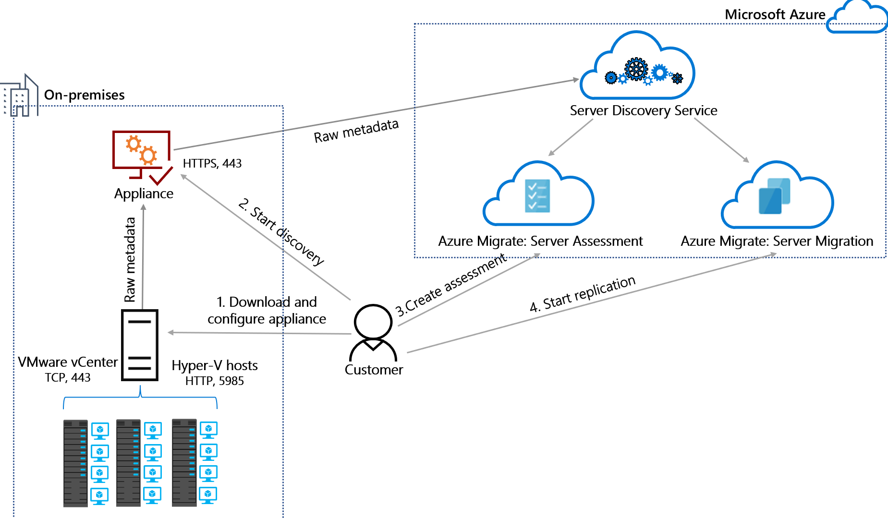
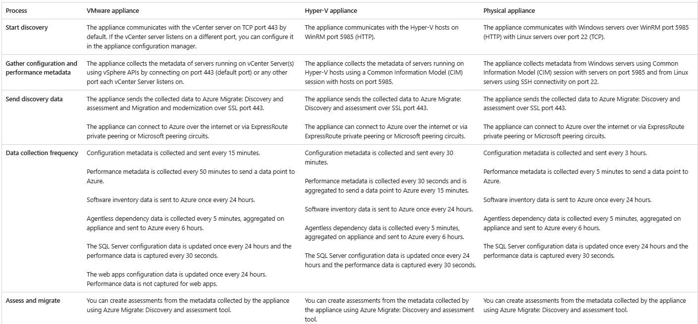
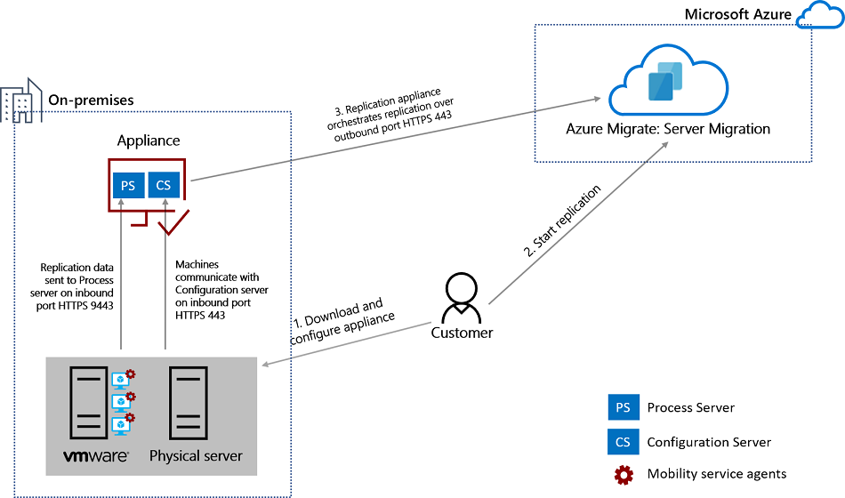

# Overview
Azure Migrate provides a simplified migration, modernization, and optimization service for Azure. All pre-migration steps such as discovery, assessments, and right-sizing of on-premises resources are included for infrastructure, data, and applications.
 
**It provides the following:**

**Unified migration platform:** A single portal to start, run, and track your migration to Azure.

**Range of tools:** A range of tools for assessment and migration. Azure Migrate tools include Azure Migrate: Discovery and assessment and Migration and modernization. Azure Migrate also integrates with other Azure services and tools, and with independent software vendor (ISV) offerings.

**Assessment, migration, and modernization:** In the Azure Migrate hub, you can assess, migrate, and modernize:
Servers, databases and web apps: Assess on-premises servers including web apps and SQL Server instances and migrate them to Azure.

**Databases:** Assess on-premises SQL Server instances and databases to migrate them to an SQL Server on an Azure VM or an Azure SQL Managed Instance or to an Azure SQL Database.
Web applications: Assess on-premises web applications and migrate them to Azure App Service and Azure Kubernetes Service.

**Virtual desktops:** Assess your on-premises virtual desktop infrastructure (VDI) and migrate it to Azure Virtual Desktop.
Data: Migrate large amounts of data to Azure quickly and cost-effectively using Azure Data Box products.
 
**The Azure Migrate:** Discovery and assessment tool discovers and assesses on-premises VMware VMs, Hyper-V VMs, and physical servers for migration to Azure.
 
The Migration and modernization tool helps in migrating servers to Azure
 
# Design
 
Azure Migrate leverages multiple tools that help with discovery, assessments, dependency analysis and migration. 
 
Discovery, Assessment
Azure Migrate Appliance is a tool used for discovering and assessing servers from on-premises or other clouds, and for agentless migration of VMware servers
 

The appliance communicates with the discovery sources using the following process.
 
 
**The appliance has the following services running on it:**

**Appliance configuration manager:** This is a web application, which can be configured with source details to start the discovery and assessment of servers.

**Discovery agent:** The agent collects server configuration metadata, which can be used to create as on-premises assessments.

**Assessment agent:** The agent collects server performance metadata, which can be used to create performance-based assessments.

**Auto update service:** The service keeps all the agents running on the appliance up-to-date. It automatically runs once every 24 hours.

**SQL discovery and assessment agent:** sends the configuration and performance metadata of SQL Server instances and databases to Azure.

**DRA agent:** Orchestrates server replication, and coordinates communication between replicated servers and Azure. Used only when replicating servers to Azure using agentless migration.

**Gateway:** Sends replicated data to Azure. Used only when replicating servers to Azure using agentless migration.
Web apps discovery and assessment agent: sends the web apps configuration data to Azure.
 
**Migration**

The Migration and modernization tool helps in migrating servers to Azure:
 
The replication appliance is deployed when you set up agent-based migration of VMware VMs or physical servers. It's deployed as a single on-premises machine, either as a VMware VM or a physical server. It runs:

**Replication appliance:** The replication appliance coordinates communications, and manages data replication, for on-premises VMware VMs and physical servers replicating to Azure.

**Process server:** The process server, which is installed by default on the replication appliance, and does the following:

    Replication gateway: It acts as a replication gateway. It receives replication data from machines enabled for replication. It optimizes replication data with caching, compression, and encryption, and sends it to Azure.

    Agent installer: Performs a push installation of the Mobility Service. This service must be installed and running on each on-premises machine that you want to replicate for migration.
 
**Azure Migrate replication process**

- When you enable replication for a VM, initial replication to Azure storage begins, using the specified replication policy.
Traffic replicates to Azure storage public endpoints over the internet. 

- Replicating traffic over a site-to-site virtual private network (VPN) from an on-premises site to Azure isn't supported.

- After initial replication finishes, delta replication begins. Tracked changes for a machine are logged.

- Communication happens as follows:
    - VMs communicate with the replication appliance on port HTTPS 443 inbound, for replication management.
    - The replication appliance orchestrates replication with Azure over port HTTPS 443 outbound.
    - VMs send replication data to the process server (running on the replication appliance) on port HTTPS 9443 inbound. This port can be modified.
    - The process server receives replication data, optimizes, and encrypts it, and sends it to Azure storage over port 443 outbound.
- The replication data logs first land in a cache storage account in Azure. These logs are processed and the data is stored in an Azure managed disk.

 
 
# Network Security
**NS-2:** Secure cloud services with network controls
Azure Private Link is supported - The customer is able to configure Azure Migrate to require Private Link
 
**Configuration Guidance:** Deploy private endpoints for all Azure resources that support the Private Link feature, to establish a private access point for the resources.
 
Azure Migrate Private Link support allows customers to securely discover, assess, and migrate servers over a private network while offering protection against data exfiltration risks and enabling greater migration velocity.
 
You can connect privately and securely to Azure Migrate over an Azure ExpressRoute private peering or a site-to-site (S2S) VPN connection by using Private Link.
 
Disable Public Network Access - Customer may configure Azure Migrate with Private Link, thereby disabling public endpoint access.
 
Configuration Guidance: Disable public network access using by toggling the switch for public network access.
 
You can configure the connectivity method for your Azure Migrate project and choose to enable or disable public network access to the Migrate project.
 
## Inbound access
**For Discovery and Assessment**

If using the Vmware appliance, The appliance communicates with the vCenter server on TCP port 443 by default. If the vCenter server listens on a different port, you can configure it in the appliance configuration manager. It also leverage this port to connect to vSphere APIs to collect the metadata of servers running on vCenter Server(s)
 
If using the Physical appliance, The appliance communicates with Windows servers over WinRM port 5985 (HTTP) with Linux servers over port 22 (TCP). The appliance uses the same ports and collects metadata from Windows servers using Common Information Model (CIM) session
 
Inbound connections on TCP port 3389 to allow remote desktop connections to the appliance itself
Inbound connections on port 44368 to remotely access the appliance management app by using the URL https://<appliance-ip-or-name>:44368
 
**For Migration**

VMs communicate with the replication appliance on port HTTPS 443 inbound, for replication management
 
VMs send replication data to the process server (running on the replication appliance) on port HTTPS 9443 inbound. This port can be modified.
 
Inbound connections on TCP port 3389 to allow remote desktop connections to the appliance itself
Inbound connections on port 44368 to remotely access the appliance management app by using the URL https://<appliance-ip-or-name>:44368
 
 
## Outbound access
Azure Migrate appliance (discovery and assessments) URL access
Azure Migrate appliance Public cloud URLs for private link connectivity
Azure Migrate replication appliance (Migrations) URL access
 
**For Discovery and Assessment**
The appliance sends the collected data to Azure Migrate: Discovery and assessment over SSL port 443.
 
**For Migration**
The replication appliance orchestrates replication with Azure over port HTTPS 443 outbound
 
The process server receives replication data, optimizes, and encrypts it, and sends it to Azure storage over port 443 outbound. By default the process server runs on the replication appliance.
 
# Encryption
## Encryption at Rest
**DP-4:** Enable data at rest encryption by default
Data at Rest Encryption Using Platform Keys: Data at-rest encryption using platform keys is supported, any customer content at rest is encrypted with these Microsoft managed keys
 
Feature notes: All data persisted in Azure Migrate is encrypted at rest with Microsoft-managed keys.
 
The Server Migration tool in Azure Migrate replicates data from the disks of servers being migrated to storage accounts and managed disks in your Azure subscription. Data handling is transient until it is written to storage accounts or managed disks in the subscription and is not persisted in Azure Migrate. Replicated data on the storage account and managed disks is encrypted at rest with Microsoft-managed keys. For highly sensitive data, you have options to implement additional encryption at rest with customer-managed keys on the storage account and managed disks.
 
Configuration Guidance: No additional configurations are required as this is enabled on a default deployment.
 
**DP-5:** Use customer-managed key option in data at rest encryption when required
Data at Rest Encryption Using CMK: Data at-rest encryption using customer-managed keys is supported for customer content stored by the service.
 
Configuration Guidance: Enable and implement data at rest encryption for your replicated data using customer-managed keys.
 
To replicate VMs with CMK, you'll need to create a disk encryption set under the target Resource Group. A disk encryption set object maps Managed Disks to a Key Vault that contains the CMK to use for SSE.
 
**DP-6:** Use a secure key management process
Key Management in Azure Key Vault: The service supports Azure Key Vault integration for any customer keys, secrets, or certificates.
 
Feature notes: The Azure Migrate appliance leverages Key Vault to manage connection strings for the service bus, and access keys for the storage accounts are used for replication.
 
Configuration Guidance: No additional configurations are required as this is enabled on a default deployment.
 
## Encryption in Transit
**DP-3:** Encrypt sensitive data in transit
Data in Transit Encryption: Service supports data in-transit encryption for data plane
 
Feature notes: Encryption of data-in-transit is enabled by default. Azure Migrate supports data encryption in transit with TLS v1.2 or greater.
 
While this is optional for traffic on private networks, this is critical for traffic on external and public networks. For HTTP traffic, ensure that any clients (including the Azure Migrate appliance and other machines on which you’ve installed Azure Migrate software) connecting to your Azure resources can negotiate TLS v1.2 or greater. For remote management, use SSH (for Linux) or RDP/TLS (for Windows) instead of an unencrypted protocol. Obsoleted SSL, TLS, and SSH versions and protocols, and weak ciphers should be disabled.
 
Configuration Guidance: No additional configurations are required as this is enabled on a default deployment.
 
 
## TLS
Encryption of data-in-transit is enabled by default. Azure Migrate supports data encryption in transit with TLS v1.2 or greater.
 
# Identity and Access Management

## Control Plane Access
Azure Migrate also supports Azure AD for user access of the control plane through the Azure Portal.

## Data Plane Access
**IM-1:** Use centralized identity and authentication system
Azure AD Authentication Required for Data Plane Access: Service supports using Azure AD authentication for data plane access.
 
**Feature notes:** Azure Migrate leverages managed identities and service principals in Azure AD for certain data plane operations. Azure Migrate also supports Azure AD for user access of the control plane through the Azure Portal.
 
**Configuration Guidance:** No additional configurations are required as this is enabled on a default deployment.
 
**IM-3:** Manage application identities securely and automatically
Managed Identities: Data plane actions support authentication using managed identities
 
**Feature notes:** Azure Migrate uses managed identity to securely access migrated data that is kept in a storage account. This is currently used in a scenario where private endpoint is configured.
 
**Configuration Guidance:** Use Azure managed identities instead of service principals when possible, which can authenticate to Azure services and resources that support Azure Active Directory (Azure AD) authentication. Managed identity credentials are fully managed, rotated, and protected by the platform, avoiding hard-coded credentials in source code or configuration files.
 
**Service Principals:** Data plane supports authentication using service principals
 
**Feature notes:** The discovery and assessment services within Azure Migrate do not use service principals, however the migration service does use service principals in a public endpoint scenario to connect to the customer’s key vault using Hyper-V recovery manager app.
 
**Configuration Guidance:** There is no current Microsoft guidance for this feature configuration. Please review and determine if your organization wants to configure this security feature.
 
**IM-8:** Restrict the exposure of credential and secrets
Service Credential and Secrets Support Integration and Storage in Azure Key Vault : Data plane supports native use of Azure Key Vault for credential and secrets store.
 
**Feature notes:** The Azure Migrate appliance leverages Key Vault to manage connection strings for the service bus, and access keys for the storage accounts are used for replication.
 
**Configuration Guidance:** No additional configurations are required as this is enabled on a default deployment.
 
 
## Application/System Access - Managed Identity
## User Access
Ensure you have the correct permissions to create a project using the following steps:

In the Azure portal, open the relevant subscription, and select Access control (IAM).
In Check access, find the relevant account, and select it and view permissions. You should have Contributor or Owner permissions.

# GxP
## Backup
Azure Migrate is classified as customer managed Disaster Recovery, which means Azure Migrate doesn't offer to recover data from an alternate region and offer it to customers when the project region isn't available.

While using different capabilities, it's recommended that you export the software inventory, dependency analysis, and assessment report for an offline backup.

In the event of a regional failure or outage in the Azure region that your project is created in:

You might not be able to access your Azure Migrate projects, assessments, and other reports during the outage. However, you can use the offline copies that you exported.
Any in-progress replication and/or migration are paused and you might have to restart it post the outage.
## Auditing
**LT-4:** Enable logging for security investigation
Azure Resource Logs: Service produces resource logs that can provide enhanced service-specific metrics and logging. The customer can configure these resource logs and send them to their own data sink like a storage account or log analytics workspace.
 
Configuration Guidance: This feature is not supported to secure this service.
 
## Monitoring
1. **Set Up Comprehensive Monitoring:** Use a combination of Azure Monitor, Log Analytics, and Application Insights to get a complete view of your environment.
2. **Automate Alerts:** Automate alerts for critical issues to ensure prompt response and resolution.
3. **Regularly Review Reports:** Regularly review performance and health reports to identify and address any potential issues.
4. **Optimize Resource Utilization:** Continuously monitor resource utilization to optimize costs and performance in the Azure environment.
5. **Document Issues and Resolutions:** Maintain a log of issues encountered during the migration and their resolutions for future reference and continuous improvement.
 
# Enforcements & Policies
**Azure Policy**
AM-2: Use only approved services
Azure Policy Support: Service configurations can be monitored and enforced via Azure Policy.
 
Feature notes: Azure Migrate may leverage Azure Policy, however it must be configured by the customer to be enforced.
 
Configuration Guidance: Use Microsoft Defender for Cloud to configure Azure Policy to audit and enforce configurations of your Azure resources. Use Azure Monitor to create alerts when there is a configuration deviation detected on the resources. Use Azure Policy [deny] and [deploy if not exists] effects to enforce secure configuration across Azure resources.
 
**Policy Definitions**
 
# IQ/OQ
 
# DECOM
Decom can be initiated through several ways:
1. From server overview page, Click on the delete button
2. From resource group overview page, Choose the server resources and click on the delete button
3. From resource group overview page, Click on delete resource group button ( all resources under that resource group will be deleted )
4. From subscription page -> settings -> resources, Choose the server resources and click on the delete button
5. From cloud shell or other CLI tools, use command to remove the DB server
6. From API command to call the server delete action
 
**Notes:**
- Once DECOM initiated, harmonize provisioning will happen automatically.  Both CMDB CI and IQOQ will be updated as decommisioned.  Notification email will be sent
- Extra resources related to the removed server should be cleaned regularly by Client DBAs. For example, private endpoint, network interface card(resource name have server name embedded)
 
# Limitations
While Azure Migrate is a powerful tool for assessing and migrating workloads to Azure, there are some limitations and considerations to keep in mind:

**Compatibility**: Azure Migrate supports assessment and migration of a wide range of workloads, but not all workloads are compatible. Before using Azure Migrate, it's important to ensure that your workloads are compatible with the tool.

**Assessment Accuracy**: While Azure Migrate provides accurate assessments of your on-premises workloads, the accuracy of the assessment depends on the quality of the data collected during the discovery process. It's important to ensure that the discovery process is thorough and accurate to ensure that the assessment is accurate.

**Migration Complexity**: Migrating workloads to Azure can be complex, especially if you have complex dependencies between applications and workloads. It's important to carefully plan your migration and ensure that you have the necessary resources and expertise to complete the migration successfully.

# FAQs

## 1.What can I do with Azure Migrate?

Use Azure Migrate to discover, assess, and migrate on-premises infrastructure, applications, and data to Azure. Azure Migrate supports assessment and migration of on-premises VMware VMs, Hyper-V VMs, physical servers, other virtualized VMs, databases, web apps, and virtual desktops.

## 2.What's the difference between Azure Migrate: Discovery and assessment and the MAP Toolkit?

- **Server Assessment**: Provides assessment to help with migration readiness and evaluation of workloads for migration to Azure.
- **Microsoft Assessment and Planning (MAP) Toolkit**: Helps with tasks like migration planning for newer versions of Windows client and server operating systems, and software usage tracking. Continue to use the MAP Toolkit for these scenarios.

## 3.What's the difference between Server Assessment and the Site Recovery Deployment Planner?

- **Server Assessment**: A migration planning tool used to assess on-premises workloads and provide guidance for migration to Azure.
- **Site Recovery Deployment Planner**: A disaster recovery planning tool providing deep, Site Recovery-specific assessment and recommendations for disaster recovery.

### Tool Selection Based on Objective:

- **Migration Planning**: Use Server Assessment.
- **Disaster Recovery Planning**: Use the Site Recovery Deployment Planner.

## 4.How does the Migration and modernization tool work with Site Recovery?

- **Agentless Migration of VMware VMs**: Performed natively by Azure Migrate without using Site Recovery.
- **Agent-based Migration of VMware VMs, Hyper-V VMs, or Physical Servers**: Uses the Azure Site Recovery replication engine.

## 5.What does Azure Migrate do to ensure data residency?

When creating a project, you select a geography. The project and related resources are created in a region within the selected geography. Azure Migrate ensures data residency and resiliency by not moving or storing customer data outside the allocated region.

For additional project region options, use the link: [Project Region Selection](https://aka.ms/migrate/ProjectRegionSelection).

## 6.Does Azure Migrate offer Backup and Disaster Recovery?

Azure Migrate is classified as customer-managed Disaster Recovery. It doesn't offer to recover data from an alternate region if the project region is unavailable.

### Recommendations:

- Export software inventory, dependency analysis, and assessment reports for offline backup.
- During a regional failure or outage, offline copies can be used.
- In-progress replication and/or migration will be paused and might need to be restarted post-outage.

## 7.Can an Azure Migrate resource be moved?

No, Azure Migrate doesn't support moving resources. To move resources created by Azure Migrate, create a new project in the desired region.

# Support

# Refrence
- https://learn.microsoft.com/en-us/azure/migrate/migrate-appliance 
-  https://learn.microsoft.com/en-us/azure/migrate/migrate-replication-appliance 
- https://learn.microsoft.com/en-us/azure/migrate/migrate-replication-appliance#replication-process
-  https://learn.microsoft.com/en-us/security/benchmark/azure/baselines/azure-migrate-security-baseline#ns-2-secure-cloud-services-with-network-controls
- https://learn.microsoft.com/en-us/azure/migrate/migrate-appliance#public-cloud-urls 
-  https://learn.microsoft.com/en-us/azure/migrate/migrate-appliance#public-cloud-urls-for-private-link-connectivity
- https://learn.microsoft.com/en-us/azure/migrate/migrate-replication-appliance#url-access
-  https://learn.microsoft.com/en-us/security/benchmark/azure/baselines/azure-migrate-security-baseline#dp-4-enable-data-at-rest-encryption-by-default
-  https://learn.microsoft.com/en-us/security/benchmark/azure/baselines/azure-migrate-security-baseline#dp-5-use-customer-managed-key-option-in-data-at-rest-encryption-when-required
- https://learn.microsoft.com/en-us/security/benchmark/azure/baselines/azure-migrate-security-baseline#dp-6-use-a-secure-key-management-process
- https://learn.microsoft.com/en-us/security/benchmark/azure/baselines/azure-migrate-security-baseline#dp-3-encrypt-sensitive-data-in-transit